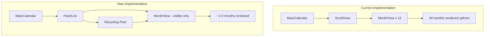

# Design Document: FlashList Calendar Optimization

## Overview

This feature replaces the ScrollView-based calendar implementation with Shopify's FlashList to achieve virtualized rendering. Currently, all 12 months render upfront causing slow initial load and janky scrolling. FlashList renders only visible months plus a buffer, recycling off-screen components for dramatic performance improvement while maintaining all existing calendar functionality.

## Architecture



## Components and Interfaces

### MainCalendar (updated)

Replace ScrollView with FlashList:

```typescript
import { FlashList } from '@shopify/flash-list';

interface MainCalendarProps {
  onDatePress?: (dateStr: string) => void;
  onAnnualLeaveClose?: () => void;
  months: MonthItem[];
  currentYear: number;
  scrollToToday: () => void;
  shouldScrollToToday: boolean;
}
```

Key changes:
- Replace `ScrollView` with `FlashList`
- Use `scrollToIndex` instead of `measureLayout` for month navigation
- Add `estimatedItemSize` based on typical month height
- Remove manual month refs (FlashList handles this internally)

### FlashList Configuration

```typescript
<FlashList
  ref={flashListRef}
  data={months}
  renderItem={renderMonthItem}
  estimatedItemSize={ESTIMATED_MONTH_HEIGHT}
  keyExtractor={(item) => `month-${item.index}`}
  getItemType={() => 'month'}
  showsVerticalScrollIndicator={false}
  initialScrollIndex={shouldScrollToToday ? currentMonthIndex : 0}
/>
```

### MonthView (minimal changes)

The existing MonthView component works as-is with FlashList. Only change:
- Remove `ref` forwarding (FlashList manages item refs internally)
- Ensure component is properly memoized (already done with `React.memo`)

### Scroll Methods

Replace measureLayout-based scrolling with FlashList's built-in methods:

```typescript
const flashListRef = useRef<FlashList<MonthItem>>(null);

const handleScrollToMonth = useCallback((monthIndex: number) => {
  flashListRef.current?.scrollToIndex({
    index: monthIndex,
    animated: true,
  });
}, []);
```

## Data Models

### MonthItem (unchanged)

```typescript
interface MonthItem {
  index: number;  // 0-11
  data: MonthData;
}

interface MonthData {
  monthStart: Date;
  rows: WeekData[];
}
```

### Estimated Item Size

```typescript
// Calculate based on typical month layout:
// - Month title: ~40px
// - Days header: ~30px  
// - Week rows: 5-6 rows × ~60px each = ~300-360px
// - Padding: ~24px
const ESTIMATED_MONTH_HEIGHT = 420;
```

## Correctness Properties

*A property is a characteristic or behavior that should hold true across all valid executions of a system-essentially, a formal statement about what the system should do. Properties serve as the bridge between human-readable specifications and machine-verifiable correctness guarantees.*

Property 1: Initial scroll targets current month
*For any* current date, the calendar's initialScrollIndex SHALL equal the current month index (0-11).
**Validates: Requirements 2.2**

Property 2: Date press returns correct date
*For any* date in the calendar, pressing that date SHALL trigger onDatePress with the exact date string in YYYY-MM-DD format.
**Validates: Requirements 3.1**

Property 3: Scroll-to-today targets correct month
*For any* current date, calling scrollToToday SHALL invoke scrollToIndex with the current month index (0-11).
**Validates: Requirements 4.1**

## Error Handling

| Scenario | Handling |
|----------|----------|
| FlashList fails to scroll | Log warning, calendar remains functional at current position |
| Month data is empty | Render empty state, no crash |
| estimatedItemSize mismatch | FlashList auto-adjusts, may cause minor scroll jank |
| Rapid year navigation | Debounce year changes, update data atomically |

## Testing Strategy

### Property-Based Testing

Use `fast-check` for property-based testing.

Each property test will:
- Generate random dates/months
- Verify the property holds across all generated inputs
- Run minimum 100 iterations per property

Property tests will be annotated with:
```typescript
// **Feature: flashlist-calendar-optimization, Property {N}: {property_text}**
```

### Unit Tests

- Test initialScrollIndex calculation for various dates
- Test scrollToMonth with valid/invalid indices
- Test renderItem returns correct MonthView for each month
- Test keyExtractor uniqueness

### Integration Points

- Mock FlashList ref methods for scroll testing
- Use existing calendar test utilities for date generation

## File Structure

```
src/
├── components/
│   └── calendar/
│       ├── main-calendar.tsx      # Updated with FlashList
│       ├── month-view.tsx         # Minor ref changes
│       └── calendar-constants.ts  # Add ESTIMATED_MONTH_HEIGHT
```

## Migration Notes

1. Install `@shopify/flash-list` package
2. Update `main-calendar.tsx` to use FlashList
3. Remove monthRefs tracking (FlashList handles internally)
4. Replace measureLayout scrolling with scrollToIndex
5. Add estimatedItemSize constant
6. Test scroll-to-today functionality
7. Verify all existing features work (platoon colors, indicators, leave highlighting)
