# Design Document: RevenueCat Ad Removal

## Overview

This feature integrates RevenueCat for in-app purchase management to allow users to purchase FireCal Pro and remove ads. The implementation uses RevenueCat's pre-built Paywall UI for purchases and Customer Center for subscription management. A React Context manages subscription state, with local caching via AsyncStorage to prevent ad flicker on app launch. The ad banner is positioned below the status bar using proper SafeAreaView handling, and disappears cleanly when the user purchases FireCal Pro access.

## Architecture

```mermaid
flowchart TD
    subgraph App Launch
        A[App Starts] --> B[Read cached status from AsyncStorage]
        B --> C{Cached ad-free?}
        C -->|Yes| D[Hide ad banner immediately]
        C -->|No| E[Show ad banner]
        D --> F[Initialize RevenueCat]
        E --> F
        F --> G[Fetch customer info]
        G --> H[Update cache & UI]
    end

    subgraph Purchase Flow
        I[User taps Upgrade] --> J[Present Paywall UI]
        J --> K{Paywall Result?}
        K -->|PURCHASED/RESTORED| M[Update cache]
        M --> N[Hide ad banner]
        K -->|CANCELLED/ERROR| O[Keep current state]
    end
    
    subgraph Customer Center Flow
        P[User taps Manage] --> Q[Present Customer Center]
        Q --> R[User manages subscription]
        R --> S[Dismiss Customer Center]
    end
```



## Components and Interfaces

### SubscriptionContext

Central state management for subscription status.

```typescript
interface SubscriptionContextType {
  hasFireCalPro: boolean;
  isLoading: boolean;
  presentPaywall: () => Promise<void>;
  presentCustomerCenter: () => Promise<void>;
}
```

### SubscriptionProvider

Wraps the app and provides subscription state. Responsibilities:
- Initialize RevenueCat SDK with API key on mount
- Read cached status from AsyncStorage before first render
- Listen for customer info updates
- Sync status to local cache on changes
- Present Paywall UI using `RevenueCatUI.presentPaywall()`
- Present Customer Center using `RevenueCatUI.presentCustomerCenter()`

### BannerAdComponent (updated)

Conditionally renders based on subscription status:
- Returns `null` when `hasFireCalPro` is true
- Collapses to zero height when ad fails to load
- No placeholder or reserved space when hidden

### Paywall UI Integration

Uses RevenueCat's pre-built paywall:
- Presents modally via `RevenueCatUI.presentPaywall()`
- Handles purchase flow, restore, and errors automatically
- Returns `PAYWALL_RESULT` enum (PURCHASED, RESTORED, CANCELLED, ERROR, NOT_PRESENTED)
- Displays configured offerings from RevenueCat dashboard

### Customer Center Integration

Uses RevenueCat's pre-built customer center:
- Presents modally via `RevenueCatUI.presentCustomerCenter()`
- Shows subscription details, management options, and support
- Handles restore and refund requests
- Only shown to users with active FireCal Pro entitlement

### Layout Changes

Remove hacky code from `app/(tabs)/_layout.tsx`:
- Remove `headerStatusBarHeight: 0` override
- Remove manual `Constants.statusBarHeight` padding
- Use `SafeAreaView` edges properly for ad banner positioning

## Data Models

### Cached Subscription Status

```typescript
// Stored in AsyncStorage under key 'firecal_pro_status'
interface CachedSubscriptionStatus {
  hasFireCalPro: boolean;
  lastChecked: number; // timestamp
}
```

### RevenueCat Configuration

```typescript
const REVENUECAT_CONFIG = {
  apiKey: 'test_wFSAMyRgVCltDolNsCYlwByHuFX', // Test API key (same for iOS/Android in test mode)
  entitlementId: 'FireCal Pro',  // Entitlement identifier in RevenueCat
  productId: 'lifetime', // Product identifier for lifetime purchase
};
```

### Paywall Result Types

```typescript
enum PAYWALL_RESULT {
  PURCHASED = 'PURCHASED',
  RESTORED = 'RESTORED',
  CANCELLED = 'CANCELLED',
  ERROR = 'ERROR',
  NOT_PRESENTED = 'NOT_PRESENTED'
}
```

## Correctness Properties

*A property is a characteristic or behavior that should hold true across all valid executions of a system-essentially, a formal statement about what the system should do. Properties serve as the bridge between human-readable specifications and machine-verifiable correctness guarantees.*


Property 1: Cache determines initial ad visibility
*For any* cached subscription status, the initial ad banner visibility SHALL match the cached hasFireCalPro value before any network request completes.
**Validates: Requirements 1.1, 1.3**

Property 2: RevenueCat fetch updates cache
*For any* successful RevenueCat customer info fetch, the local AsyncStorage cache SHALL be updated with the current FireCal Pro status.
**Validates: Requirements 1.2**

Property 3: Ad banner visibility matches subscription state
*For any* subscription state where hasFireCalPro is true, the ad banner component SHALL return null (not render). *For any* state where hasFireCalPro is false, the ad banner SHALL render.
**Validates: Requirements 2.1, 3.3**

Property 4: Successful paywall result updates state
*For any* paywall result of PURCHASED or RESTORED, the hasFireCalPro state SHALL become true immediately.
**Validates: Requirements 3.2**

Property 5: Cancelled paywall maintains state
*For any* paywall result of CANCELLED or ERROR, the hasFireCalPro state SHALL remain unchanged from its value before the attempt.
**Validates: Requirements 3.4**

Property 6: Successful restore updates state
*For any* restore operation that finds a valid FireCal Pro entitlement, the hasFireCalPro state SHALL become true.
**Validates: Requirements 4.2**

Property 7: Settings screen reflects subscription state
*For any* hasFireCalPro value, the settings screen SHALL display the upgrade button when false, and confirmation text with manage button when true.
**Validates: Requirements 6.1, 6.2, 6.3, 6.4**

Property 8: Customer Center presents for Pro users
*For any* user with hasFireCalPro true, calling presentCustomerCenter SHALL display the Customer Center UI.
**Validates: Requirements 7.1, 7.2**

## Error Handling

| Scenario | Handling |
|----------|----------|
| RevenueCat SDK fails to initialize | Log error, use cached status, retry on next app launch |
| Network unavailable during fetch | Use cached status, don't update cache |
| Paywall returns CANCELLED | Silently maintain current state, dismiss paywall |
| Paywall returns ERROR | Log error, maintain current state, dismiss paywall |
| Paywall returns NOT_PRESENTED | Log warning, maintain current state |
| Customer Center restore fails | Handle via Customer Center callbacks, show error in UI |
| AsyncStorage read fails | Default to showing ads (hasFireCalPro = false) |
| Ad fails to load | Collapse banner to zero height |

## Testing Strategy

### Property-Based Testing

Use `fast-check` for property-based testing of the subscription logic.

Each property test will:
- Generate random subscription states and RevenueCat responses
- Verify the property holds across all generated inputs
- Run minimum 100 iterations per property

Property tests will be annotated with:
```typescript
// **Feature: revenuecat-ad-removal, Property {N}: {property_text}**
```

### Unit Tests

- Test SubscriptionContext initialization with various cached states
- Test paywall presentation and result handling
- Test Customer Center presentation
- Test BannerAdComponent conditional rendering
- Test Settings screen rendering based on subscription state

### Integration Points

- Mock `react-native-purchases` for all tests
- Mock `react-native-purchases-ui` for Paywall and Customer Center tests
- Mock `@react-native-async-storage/async-storage` for cache tests
- Mock `react-native-google-mobile-ads` for ad banner tests

## File Structure

```
src/
├── contexts/
│   └── subscription/
│       ├── subscription-context.tsx    # Context + Provider with Paywall/Customer Center
│       └── subscription-storage.ts     # AsyncStorage helpers
├── components/
│   └── ads/
│       └── banner-ad.tsx              # Updated with subscription check
app/
├── _layout.tsx                        # Add SubscriptionProvider
└── (tabs)/
    ├── _layout.tsx                    # Clean up hacky code
    └── settings.tsx                   # Add Paywall/Customer Center buttons
```
